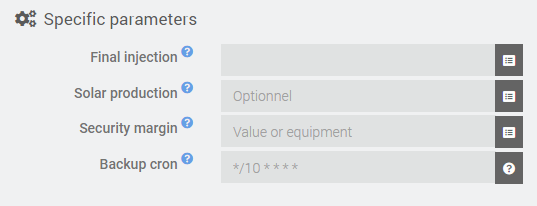

# Autoconsommation Plugin

**Jeedom** plugin to optimize electrical auto-consumption (in case of solar power plan).

The plugin will turn other equipment's ON or OFF depending on the measured electrical balance of the house.
This plugin expects you to provide this information in real-time (typically based on a power meter).

**Note**: This plugin considers positive power as what is injected back to the grid.
(This allows to be consistent with a positive power from the solar inverter.)

# Plugin configuration
After downloading the plugin, you just need to activate it, there is no configuration at this level.

# Equipment configuration
## Equipment tab
In the *General settings* section, you find the usual parameters of a **Jeedom** plugin.

The *Specific parameters* allow to configure what is needed to run an instance of Autoconsommation.

- **Final injection** : Equipment info with the total instant situation of electrical injection for the house (mandatory)
- **Solar production** : Equipment info with the instant electrical production from the solar inverter (optional)
- **Security margin** : Fixed value or info equipment to define a security margin of minimum injection to consider in the regulation
- **Backup cron** : Cron expression to run the optimization algorithm at a regular pace (in case the triggers would not be sufficient)

## Commands tab
The *Commands* tab holds only the default action that runs the optimization algorithm.
There is nothing to configure here.

## Equipment table tab

The *Equipment table* tab defines the equipment's that will be controlled when optimizing auto-consumption.

For each equipment (row), all parameters are mandatory

- **Name** : Name of the equipment (only used to identify it within the plugin)
- **Power** : Estimated power consumption of the equipment
- **State command** : Info command (binary) that returns the state of the equipment (1=ON ; 0=OFF)
- **ON command** : Action command to turn the equipment ON
- **OFF command** : Action command to turn the equipment OFF

The rows of the table can be reordered by drag & drop to define the priority between the commands
