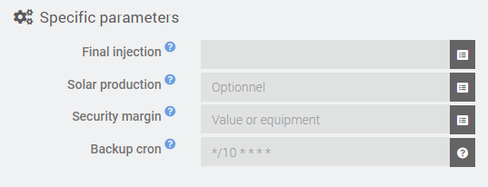
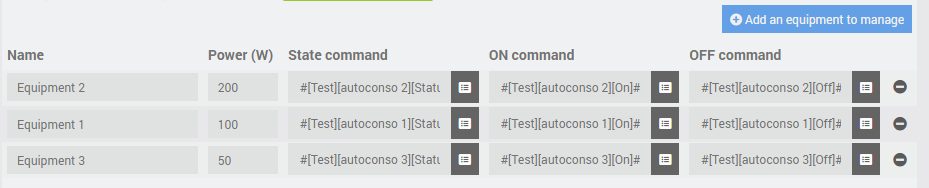

# Plugin Autoconsommation

Plugin **Jeedom** pour optimiser l'auto-consommation électrique (en cas d'installation photovoltaïque).

Ce plugin va allumer et éteindre les autres équipements en fonction du bilan électrique net de la maison.
Ce plugin compte sur une mesure temps-réel de l'injection électrique (typiquement fournie par un compteur électrique).

**Note**: Ce plugin considère une puissance positive quand on injecte du courant sur le réseau.
(Ceci permet d'être consistent avec la valeur positive de production de l'onduleur.)

# Configuration du plugin
Après avoir téléchargé le plugin, il suffit de l'activer, il n'y a aucune configuration à ce niveau.

# Configuration de l'équipement
## Onglet Equipment
Dans la section *Paramètres généraux*, vous trouverez les paramètres habituels d'un plugin **Jeedom**.

Les *Paramètres spécifiques* permettent de configurer ce qui est nécessaire pour faire fonctionner une instance d'Autoconsommation.

- **Injection nette** : Equipement info qui renseigne l'injection électrique totale nette de l'habitation (obligatoire)
- **Production solaire** : Equipment info qui renseigne la production électrique instantanée venant de l'onduleur (optionel)
- **Marge de sécurité** : Valeur fixe ou équipment info qui renseigne la marge de sécurité d'injection minimale à prendre en compte pendant l'optimisation
- **Cron de sécurité** : Expression cron pour exécuter l'optimisation à un rythme régulier (au cas où le rythme de calcul ne serait pas suffisant)

## Onglet Commandes
L'onglet *Commandes* contient uniquement l'action par défaut qui éxecute l'algorithme d'optimisation.
Il n'y a rien à configurer ici.

## Onglet Tableau d'équipements

L'onglet *Tableau d'équipement* défini les équipements qui seront contrôlés par l'outil d'optimisation d'auto-consommation.

Pour chaque équipement (ligne du tableau), tous les paramètres sont obligatoires

- **Nom** : Nom de l'équipement (seulement utilisé pour l'identifier dans le plugin)
- **Puissance** : Puissance de consommation estimée de l'équipement
- **Commande de statut** : Commande info (binaire) qui renvoie l'état de l'équipement (1=ON ; 0=OFF)
- **Commande ON** : Commande action pour allumer l'équipement
- **Commande OFF** : Commande action pour éteindre l'équipement

Les lignes du tableau peuvent être réordonnées en les glissant avec la souris pour définir la priorité entre les commandes
